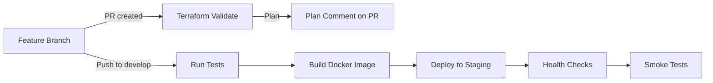
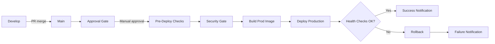

# CI/CD Pipeline Configuration

This directory contains CI/CD configuration and automation files for the code-server enterprise infrastructure.

## Overview

The CI/CD system provides:
- **Continuous Integration**: Automated testing, validation, and quality checks
- **Continuous Deployment**: Automated deployment to staging and production
- **Security Scanning**: Vulnerability detection and compliance validation
- **Performance Monitoring**: Automated performance benchmarking

## GitHub Actions Workflows

### 1. terraform-validate.yml
Validates Terraform code on all PRs and pushes.

**Triggers**:
- Pull requests to `main` or `develop` with terraform/ path changes
- Pushes to `main` or `develop` with terraform/ path changes

**Jobs**:
- `validate`: Format check, syntax validation, TFLint
- `plan`: Preview all changes with terraform plan
- `security-scan`: Trivy + Checkov scanning

**Run Time**: ~5-10 minutes

### 2. test-suite.yml
Comprehensive testing suite with multiple test types.

**Triggers**:
- Pull requests with agent-farm/ or tests/ path changes
- Pushes to `main` or `develop`
- Daily schedule (2 AM UTC)

**Jobs**:
- `unit-tests`: Jest unit tests with coverage
- `integration-tests`: Integration tests with PostgreSQL + Redis services
- `security-tests`: Security validation + npm audit + Snyk SAST
- `performance-tests`: Load testing and benchmarking
- `coverage-report`: Merged coverage with PR comment

**Coverage Targets**:
- Statements: 85%
- Branches: 80%
- Functions: 85%
- Lines: 85%

**Run Time**: ~20-30 minutes

### 3. deploy-staging.yml
Automated deployment to staging environment.

**Triggers**:
- Push to `develop` branch
- Manual workflow dispatch

**Jobs**:
- `validate`: Pre-deployment validation
- `security-scan`: Trivy security scan
- `build`: Docker image build and push (GHCR)
- `deploy`: Terraform deploy to staging + health checks
- `notification`: Slack notification on completion

**Environment**: Staging Kubernetes cluster

**Run Time**: ~15-20 minutes

### 4. deploy-prod.yml
Production deployment with approval gates and automatic rollback.

**Triggers**:
- Push to `main` branch
- Workflow completion (Test Suite + Deploy Staging)
- Manual workflow dispatch

**Jobs**:
- `approval`: Manual approval gate (requires GitHub environment approval)
- `pre-deploy-checks`: Git verification, dependency audit, state backup
- `security-gate`: Production security scanning
- `build-production`: Production Docker image + SBOM + image signing
- `deploy-production`: Terraform deploy with blue-green rollout
- `rollback`: Automatic rollback on failure

**Approval Required**: Yes (GitHub environment approval)

**Environment**: Production Kubernetes cluster

**Run Time**: ~20-30 minutes (including approval wait)

### 5. dependency-scan.yml
Weekly dependency and license scanning.

**Triggers**:
- Weekly schedule (Sunday 3 AM)
- Pull requests with package.json or terraform/ changes

**Jobs**:
- `dependencies`: npm audit, license check, SBOM generation
- `licenses`: License compliance validation

**Output**: Artifacts with audit results, license reports, SBOM

**Run Time**: ~10 minutes

### 6. code-quality.yml (Not automated yet - name conflict exists)

Would provide:
- ESLint validation
- Prettier format check
- Terraform format validation
- Type checking (TypeScript)
- Complexity analysis
- Dependency auditing

## Environment Variables

### Required Secrets (GitHub)

```yaml
# Kubernetes
KUBECONFIG_STAGING: base64-encoded staging kubeconfig
KUBECONFIG_PROD: base64-encoded production kubeconfig

# Storage & State
TF_STATE_BUCKET: S3 bucket or GCS bucket for Terraform state
AWS_REGION: AWS region (if using S3)
AWS_ACCESS_KEY_ID: AWS credentials
AWS_SECRET_ACCESS_KEY: AWS credentials

# Build & Deploy
CONTAINER_REGISTRY_USERNAME: GitHub username (for GHCR)
CONTAINER_REGISTRY_TOKEN: GitHub token with packages scope

# Security
SNYK_TOKEN: Snyk token for SAST
SONAR_HOST_URL: SonarQube server URL (optional)
SONAR_TOKEN: SonarQube authentication token (optional)

# Notifications
SLACK_WEBHOOK: Slack webhook for deployment notifications

# Code Signing
COSIGN_PRIVATE_KEY: Private key for image signing (optional)
```

### How to Configure

1. Go to GitHub repository Settings → Secrets and variables → Actions
2. Add each required secret with its value
3. For environments (staging/production):
   - Settings → Environments → Create
   - Configure protection rules and additional secrets per environment

## Configuration Files

### terraform.tfvars.staging
Configuration for staging deployment.

```hcl
kubeconfig_context = "staging-cluster"
cluster_name       = "staging-k8s"
domain             = "staging.code-server.internal"
code_server_replicas = 2
```

### terraform.tfvars.production
Configuration for production deployment.

```hcl
kubeconfig_context = "production-cluster"
cluster_name       = "prod-k8s"
domain             = "code-server.example.com"
code_server_replicas = 3
```

## Deployment Flow

### PR/Feature Branch → Staging



### Main Branch → Production



## Monitoring & Debugging

### View Workflow Runs

1. Go to GitHub repo → Actions
2. Select workflow name
3. Click on specific run to see logs
4. Download artifacts if needed

### Troubleshooting Common Issues

**Terraform Plan Fails**
- Check kubeconfig is valid
- Verify Terraform version compatibility
- Review recent terraform/ changes

**Tests Fail**
- Check logs in Actions
- Download test artifacts
- Review recent code changes

**Deployment Fails**
- Check Kubernetes cluster connectivity
- Verify node resources available
- Check security policies

**Security Scan Issues**
- Review Snyk/Trivy findings
- Update vulnerable dependencies
- Exclude false positives in config

## Local Testing

### Test Workflows Locally

Use `act` to run GitHub Actions locally:

```bash
# Install act
brew install act

# Run specific workflow
act -j terraform-validate

# Run all workflows
act

# With secrets
act --secret KUBECONFIG_STAGING="$(cat ~/.kube/staging)"
```

### Manual Testing

```bash
# Terraform validate
cd terraform
terraform init -backend=false
terraform validate

# Run tests
cd extensions/agent-farm
npm test

# Build Docker image
docker build -t code-server:test .

# Lint and format
npm run lint
npm run format
```

## Rollback Procedures

### Manual Rollback

If automatic rollback fails:

```bash
# Connect to production cluster
kubectl --context production rollout undo deployment/code-server -n code-server

# Verify
kubectl --context production rollout status deployment/code-server -n code-server
kubectl --context production get pods -n code-server

# Check health
./scripts/health-check.sh production
```

### Rollback Previous State

```bash
# List state backups
aws s3 ls s3://$TF_STATE_BUCKET/backups/

# Restore state
aws s3 cp s3://$TF_STATE_BUCKET/backups/YYYY-MM-DD-HHMMSS.json - | \
  terraform state push -

# Verify
terraform state list
```

## Performance Optimization

### Caching

GitHub Actions automatically caches:
- Node modules (npm cache)
- Docker layers (buildx cache)
- Terraform plugins

Cache keys use:
- Dependency files (package-lock.json, go.sum)
- Workflow file name
- Commit SHA

### Parallel Execution

Workflows use:
- Matrix strategy for test suite (multiple test types)
- Concurrent workflows (prevent overlapping deployments)
- Service containers (PostgreSQL, Redis)

### Cost Optimization

**Minutes Usage**:
- validate-terraform: 5-10 min
- test-suite: 20-30 min
- deploy-staging: 15-20 min
- deploy-prod: 20-30 min
- Weekly scans: 10 min

**Total**: ~100-150 minutes/week

## Best Practices

1. **Always test locally first**
   - Use `act` for workflow testing
   - Run tests before pushing

2. **Use feature branches**
   - Develop on feature branches
   - This triggers PR validation
   - Deploy to staging on develop push

3. **Approve production deployments carefully**
   - Review plan before approval
   - Check test results
   - Monitor after deployment

4. **Monitor production**
   - Check logs and metrics
   - Review alerts
   - Watch error rates

5. **Keep workflows simple**
   - One responsibility per job
   - Clear failure messages
   - Good error handling

## Next Steps

1. Deploy GitHub Actions workflows to git repository
2. Configure GitHub secrets and environments
3. Create terraform.tfvars.staging and .production files
4. Test with feature branch deployment to staging
5. Validate production deployment process
6. Set up monitoring and alerting
7. Document team runbooks for CI/CD operations

---

**Status**: Ready for Implementation  
**Last Updated**: 2024-01-27  
**Version**: 1.0.0
