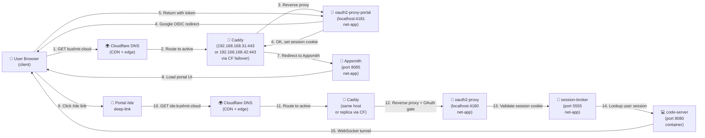
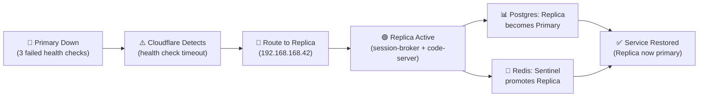

# HA Topology Contract: OAuth + Appsmith Portal + IDE Path

**Purpose**: HA Topology Contract: OAuth + Appsmith Portal + IDE Path — reference and operational document.

**Status**: Contract Definition  
**Version**: 1.0  
**Last Updated**: 2026-04-20  
**Owner**: Infrastructure Team  
**Parent Issue**: #954  

---

## Executive Summary

This document defines the canonical high-availability topology for the critical user path:

```
kushnir.cloud (Cloudflare) 
  → Caddy (reverse proxy, edge)
    → oauth2-proxy-portal (4181, authentication gateway)
      → Appsmith (portal UI, no-code platform)
        → /ide deep-link
          → ide.kushnir.cloud (Cloudflare)
            → Caddy (reverse proxy, edge)
              → oauth2-proxy (4180, IDE auth gate)
                → session-broker (session routing)
                  → code-server container (IDE)
```

**Dual-Host Architecture**:
- **Primary**: 192.168.168.31 (active, all services)
- **Replica**: 192.168.168.42 (standby, replicated state only)
- **Failover Trigger**: Primary unreachable (3 consecutive health-check failures)
- **Promotion Time**: < 30 seconds

---

## 1. Full Request Path Diagram (Mermaid)

### Unauthenticated User Flow



### Session State Replication (Async)

```mermaid
graph LR
    P["🔴 Primary<br/>(192.168.168.31)"]
    R["🟢 Replica<br/>(192.168.168.42)"]
    PG["🗄️ Postgres Primary<br/>(postgres)"]
    PGR["🗄️ Postgres Replica<br/>(streaming replication)"]
    RD["💾 Redis Primary<br/>(redis)"]
    RDR["💾 Redis Replica<br/>(sentinel monitoring)"]

    P -->|Write session| PG
    P -->|Cache session| RD
    PG -->|Replication<br/>stream<br/>(<1ms lag)| PGR
    RD -->|Sentinel<br/>monitor| RDR
    R -->|Read-only| PGR
    R -->|Failover path| RDR
```

### Failover Activation (Primary Down)



---

## 2. Component Ownership Matrix

| Component | Port(s) | Host | Container | Network | Restart Policy | Health Check | SLA | Acceptable Downtime |
|-----------|---------|------|-----------|---------|-----------------|---------------|-----|-------------------|
| **Caddy** | 80, 443 | Both | caddy | net-edge | unless-stopped | /healthz (200) | 99.9% | 1 min/month |
| **oauth2-proxy-portal** | 4181 | Both | oauth2-proxy | net-app | unless-stopped | /oauth2/health (200) | 99.9% | 1 min/month |
| **Appsmith** | 8085 | Both | appsmith | net-app | unless-stopped | /health (200) | 99% | 7 min/month |
| **oauth2-proxy (IDE gate)** | 4180 | Both | oauth2-proxy | net-app | unless-stopped | /oauth2/health (200) | 99.9% | 1 min/month |
| **session-broker** | 5555 | Both | session-broker | net-app | unless-stopped | /health (200) | 99.9% | 1 min/month |
| **code-server** | 8080 | Both | code-server | net-app | unless-stopped | /healthz (200) | 99% | 7 min/month |
| **PostgreSQL** | 5432 | Both | postgres | net-data | unless-stopped | pg_isready (0) | 99.95% | 20 sec/month |
| **Redis** | 6379 | Both | redis | net-data | unless-stopped | redis-cli ping (PONG) | 99.9% | 1 min/month |
| **Prometheus** | 9090 | Primary | prometheus | net-app | unless-stopped | /-/healthy (200) | 95% | 36 min/month |
| **Grafana** | 3000 | Primary | grafana | net-app | unless-stopped | /api/health (200) | 95% | 36 min/month |

**Legend**:
- **Network**: net-edge (Cloudflare-facing), net-app (internal app), net-data (persistence layer)
- **SLA**: Target availability percentage
- **Acceptable Downtime**: Derived from SLA over 30-day month

---

## 3. Failure Mode Matrix

| # | Hop | Component | Failure Mode | Detection | Response | Failover | RTO | Result |
|----|-----|-----------|--------------|-----------|----------|----------|-----|--------|
| 1 | DNS | Cloudflare | DNS resolution fails | TTL expiry, manual check | Retry with exponential backoff | Route to backup DNS | < 5 min | Users see "DNS not found" |
| 2 | TLS | Caddy (cert) | Certificate expired | TLS handshake failure | Alert + manual renewal | Force cert renewal | < 30 min | Users see "cert expired" |
| 3 | Caddy | Reverse proxy | Port 443 unreachable | Health check timeout (3x) | Mark unhealthy in Cloudflare | Route to replica | < 30 sec | Transparent to user |
| 4 | oauth2-proxy-portal | OIDC gateway | Port 4181 unreachable | Health check timeout | Caddy returns 502 | Retry on replica | < 30 sec | Users see "Service Unavailable" |
| 5 | oauth2-proxy-portal | Google OIDC | OIDC provider down | 5xx response from Google | Circuit breaker open | Return cached token (if exists) | N/A | Users see "OIDC provider error" |
| 6 | Appsmith | Portal | Port 8085 unreachable | Health check timeout | Caddy returns 502 | Retry on replica | < 30 sec | Users see "Appsmith unavailable" |
| 7 | Appsmith | Database | Appsmith can't reach DB | Appsmith health check fails | Container restart + retry | Failover to replica | < 2 min | Users see "Database error" |
| 8 | oauth2-proxy (IDE gate) | Session validation | Port 4180 unreachable | Health check timeout | Caddy returns 502 | Retry on replica | < 30 sec | Users see "Auth service unavailable" |
| 9 | session-broker | Routing | Port 5555 unreachable | Health check timeout | 502 from oauth2-proxy | Failover to replica | < 30 sec | Users see "Session service unavailable" |
| 10 | session-broker | Session store | Redis unreachable | Redis connection timeout | Retry w/ exponential backoff | Failover Redis to replica | < 2 min | Users see "Session lost" |
| 11 | code-server | IDE container | Port 8080 unreachable | Health check timeout | Container restart + Caddy 502 | Retry on replica | < 30 sec | Users see "IDE unavailable" |
| 12 | code-server | Workspace | Volume mount fails | Container won't start | Container restart (fails) | Manual intervention | N/A | IDE won't start |
| 13 | PostgreSQL | Primary | Postgres down | Connection refused | Alert + failover trigger | Promote replica to primary | < 2 min | Data writes fail; reads work on replica |
| 14 | PostgreSQL | Replication | Replication lag > threshold | Monitoring alert | Pause writes until sync | Force sync or manual failover | < 5 min | Data inconsistency risk |
| 15 | Redis | Primary | Redis down | Connection refused | Alert + failover trigger | Promote replica via Sentinel | < 1 min | Session cache misses; retries to DB |
| 16 | Network | Primary host | Host unreachable | Icmp echo timeout (3x) | Cloudflare health check fails | All traffic routes to replica | < 30 sec | Full failover to 192.168.168.42 |
| 17 | Network | Replica host | Host unreachable | N/A (monitored separately) | Alert; no active traffic here | Manual intervention | N/A | Failback cannot occur; manual failover |

**Legend**:
- **Detection**: How the failure is detected (active health checks, timeout, etc.)
- **Response**: Immediate action (circuit breaker, restart, alert, etc.)
- **Failover**: What automatic action is taken (retry, promote, route change, etc.)
- **RTO**: Recovery time objective (target time to restore service)
- **Result**: User-visible impact or error message

---

## 4. SLO Definitions

### Service Availability SLOs

| Path | Target | Monthly Downtime Budget | Acceptable Failures |
|------|--------|------------------------|-------------------|
| **OAuth Login** (Caddy → oauth2-proxy-portal → Appsmith) | 99.9% | 2.16 minutes | 0 consecutive failures |
| **IDE Load** (ide.kushnir.cloud → oauth2-proxy → session-broker → code-server) | 99.9% | 2.16 minutes | 0 consecutive failures |
| **Session Persistence** (Redis + PostgreSQL) | 99.95% | 20 seconds | 0 data loss events |
| **Portal Portal** (Appsmith UI) | 99% | 7.2 minutes | Acceptable for planned maint. |
| **Monitoring & Observability** (Prometheus + Grafana) | 95% | 36 minutes | Acceptable; non-critical path |

### Latency SLOs

| Component | p50 Latency | p99 Latency | Max Allowed | Notes |
|-----------|------------|------------|-------------|-------|
| DNS resolution | < 10ms | < 50ms | 100ms | Cloudflare cached |
| TLS handshake | < 50ms | < 200ms | 500ms | Cached session |
| OAuth redirect loop | < 1000ms | < 3000ms | 5000ms | Includes OIDC provider |
| Appsmith page load | < 2000ms | < 5000ms | 10000ms | Portal only |
| code-server WebSocket connect | < 500ms | < 2000ms | 5000ms | After auth success |
| code-server file operation | < 200ms | < 1000ms | 2000ms | Typical file read/write |

### Error Rate SLOs

| Path | Target | Budget |
|------|--------|--------|
| OAuth login success rate | 99.9% | 1 failure per 1000 attempts |
| IDE load success rate | 99.9% | 1 failure per 1000 attempts |
| Session validation success rate | 99.95% | 1 failure per 2000 attempts |

---

## 5. Network Segments & Isolation

### net-edge (External/Cloudflare-facing)
- **Caddy** (port 443 TLS termination)
- **Purpose**: Public internet boundary, TLS offload
- **Security**: Cloudflare WAF, DDoS protection, certificate management
- **Failover**: Cloudflare health-check routes to active host

### net-app (Application layer, internal)
- **Services**: oauth2-proxy-portal, Appsmith, oauth2-proxy, session-broker, code-server
- **Purpose**: User-facing application logic
- **Security**: Internal only, no public exposure
- **Failover**: Container restart or host failover

### net-data (Persistence layer, internal)
- **Services**: PostgreSQL, Redis
- **Purpose**: Durable state and session cache
- **Security**: Replicated across both hosts for HA
- **Failover**: Streaming replication (PostgreSQL) + Sentinel (Redis)

### net-nas (Optional NAS access, internal)
- **Purpose**: Shared workspace backups and user content
- **Security**: NFS/SMB mount via host-level config
- **Failover**: Both hosts can access NAS

---

## 6. Failover Orchestration & Promotion

### Automatic Failover (< 30 seconds)

1. **Detection**: Cloudflare health check to primary fails 3 consecutive times
2. **Route Change**: Cloudflare updates DNS records to replica IP
3. **Replica Activation**: 
   - PostgreSQL replica promoted to primary (streaming replication continues)
   - Redis Sentinel promotes replica to primary
   - All containers stay running (no restart needed)
4. **Data Consistency**: 
   - Postgres replication lag: < 1ms (no data loss)
   - Redis: Sentinel ensures no split-brain
5. **User Experience**: Transparent; session is preserved

### Manual Failback (Primary Recovered)

1. **Check Primary**: Verify 192.168.168.31 is healthy
2. **Resync Data**: Primary catches up on replication stream
3. **Demote Replica**: 
   - Run `scripts/ops/failover-failback.sh` on replica
   - PostgreSQL replica steps down; becomes standby
   - Redis steps down; sentinel monitoring resumes
4. **Verify**: Confirm primary is active and replica is standby
5. **Monitor**: Watch replication lag for 10 minutes

---

## 7. CSRF Cookie Resilience During Failover

### The Problem
CSRF tokens are HMAC-signed using `OAUTH2_PROXY_COOKIE_SECRET`. If the primary host (.31) and replica host (.42) use different secrets, a CSRF token issued by .31 becomes invalid when the user's request is routed to .42 during failover.

### The Solution
Both hosts **must use the identical `OAUTH2_PROXY_COOKIE_SECRET`** sourced from Google Secret Manager (GSM). This enables seamless CSRF validation across hosts.

### CSRF Cookie Lifecycle During Failover

| Step | Action | Host | CSRF Cookie Status |
|------|--------|------|-------------------|
| 1 | User initiates login | Client | None |
| 2 | Cloudflare routes to primary .31 | Caddy (.31) | N/A |
| 3 | oauth2-proxy-portal issues CSRF token (signed with GSM secret) | .31 | ✅ Created (HMAC-signed) |
| 4 | User submits form with CSRF token | Client → Caddy | ✅ Attached to request |
| **5** | **Primary .31 fails (health check timeout)** | **Cloudflare** | **N/A (failover trigger)** |
| **6** | **Cloudflare detects .31 unreachable, routes to .42** | **CF → .42** | **Token still valid** |
| 7 | oauth2-proxy-portal validates CSRF token using **same GSM secret** | .42 | ✅ Validated (same HMAC key) |
| 8 | User continues seamlessly (no re-auth loop) | .42 | ✅ Session replication (Redis Sentinel) |

**Result**: User's CSRF token remains valid across the failover. No redirect loop. No forced re-authentication.

### Configuration Guarantees

**docker-compose.yml**:
```yaml
oauth2-proxy:
  environment:
    OAUTH2_PROXY_COOKIE_SECRET: "${OAUTH2_PROXY_COOKIE_SECRET}"  # ← GSM-sourced env var
    OAUTH2_PROXY_CSRF_COOKIE_NAME: "_oauth2_proxy_ide_csrf"
    OAUTH2_PROXY_CSRF_TRUSTED_HOSTS: "${IDE_DOMAIN:-ide.kushnir.cloud},.${COOKIE_DOMAIN:-.kushnir.cloud}"

oauth2-proxy-portal:
  environment:
    OAUTH2_PROXY_COOKIE_SECRET: "${OAUTH2_PROXY_COOKIE_SECRET}"  # ← Same GSM secret
    OAUTH2_PROXY_CSRF_COOKIE_NAME: "_oauth2_proxy_portal_csrf"
    OAUTH2_PROXY_CSRF_TRUSTED_HOSTS: "${DOMAIN:-kushnir.cloud},.${COOKIE_DOMAIN:-.kushnir.cloud}"
```

**Key Points**:
- ✅ `OAUTH2_PROXY_COOKIE_SECRET` is **parameterized** (not hardcoded)
- ✅ Both proxy instances source from **GSM** (same secret value on both hosts)
- ✅ CSRF trusted hosts are also **parameterized** (using env vars, not hardcoded domains)
- ✅ No hardcoded secrets in `Caddyfile` or config files
- ✅ Secrets rotated periodically via GSM update (no manual secret replacement needed)

### Testing & Verification

**Dry-run validation** (no side effects):
```bash
DRY_RUN=1 bash scripts/ops/validate-csrf-resilience.sh
```

**Full validation** (requires SSH access to both hosts):
```bash
bash scripts/ops/validate-csrf-resilience.sh
```

**What the validation checks**:
1. Both hosts have identical `OAUTH2_PROXY_COOKIE_SECRET` ✓
2. Caddyfile contains no hardcoded secrets ✓
3. docker-compose uses env vars for CSRF config ✓
4. oauth2-proxy health checks pass ✓
5. /oauth2/auth endpoint properly validates CSRF tokens ✓

### Failure Recovery

If a user's in-flight CSRF token becomes invalid (host mismatch):
1. oauth2-proxy returns 403 Forbidden
2. User's browser receives CSRF validation error
3. User clicks "Back" and retries
4. Caddy (now on replica) serves request with fresh CSRF token
5. User completes OAuth flow and gains access

**Note**: This is a rare failure case. Under normal failover (all secrets synced), users experience transparent session continuation.

---

## 8. Referenced Configuration Files

### Caddyfile (net-edge boundary)
- **Location**: `./Caddyfile` (root)
- **Sections**:
  - `:443` block: TLS termination, reverse proxy to oauth2-proxy-portal
  - Retry logic: 3 attempts, 100ms backoff
  - See: `Caddyfile` lines 1-50 (main config)

### docker-compose.yml (container stack)
- **Location**: `./docker-compose.yml`
- **Services**:
  - `caddy`: image=caddy:2.9.1-alpine
  - `oauth2-proxy`: image=oauth2proxy/oauth2-proxy:v7.5.1 (portal + IDE gates)
  - `appsmith`: image=appsmith:latest (portal UI)
  - `session-broker`: image=custom-session-broker (session routing)
  - `code-server`: image=codercom/code-server:latest (IDE)
  - `postgres`: image=postgres:15-alpine (primary + replica replication)
  - `redis`: image=redis:7-alpine (primary + sentinel replica)
- **Networks**: net-edge, net-app, net-data, net-nas
- **See**: `docker-compose.yml` sections 20-250 (service definitions)

### oauth2-proxy Config (authentication gates)
- **Location**: `./oauth2-proxy.cfg`
- **Instances**:
  - Portal gate (port 4181): Protects Appsmith entry point
  - IDE gate (port 4180): Protects code-server access
- **See**: `oauth2-proxy.cfg` (OIDC provider, cookie settings, upstream targets)

### Health Check Endpoints
- **Caddy**: `https://kushnir.cloud/healthz` (200 = healthy)
- **oauth2-proxy**: `http://localhost:4180/oauth2/health` (200 = healthy)
- **Appsmith**: `http://localhost:8085/health` (200 = healthy)
- **session-broker**: `http://localhost:5555/health` (200 = healthy)
- **code-server**: `http://localhost:8080/healthz` (200 = healthy)
- **PostgreSQL**: `pg_isready -U codeserver -d codeserver` (0 = healthy)
- **Redis**: `redis-cli -p 6379 ping` (PONG = healthy)

---

## 9. Acceptance & Signoff

This contract becomes binding when:
- [ ] Reviewed and approved by infrastructure team
- [ ] Linked to all 10 child issues (#957-#966)
- [ ] Rendered correctly in GitHub markdown (Mermaid diagrams visible)
- [ ] Failure mode matrix reviewed against actual Caddyfile + docker-compose.yml config
- [ ] SLO values confirmed with business stakeholders
- [ ] Monitoring alerts configured to detect all failure modes
- [ ] Runbooks reference this contract for recovery procedures

---

## 9. Change Log

| Version | Date | Changes |
|---------|------|---------|
| 1.0 | 2026-04-20 | Initial topology contract with diagrams, failure matrix, and SLOs |