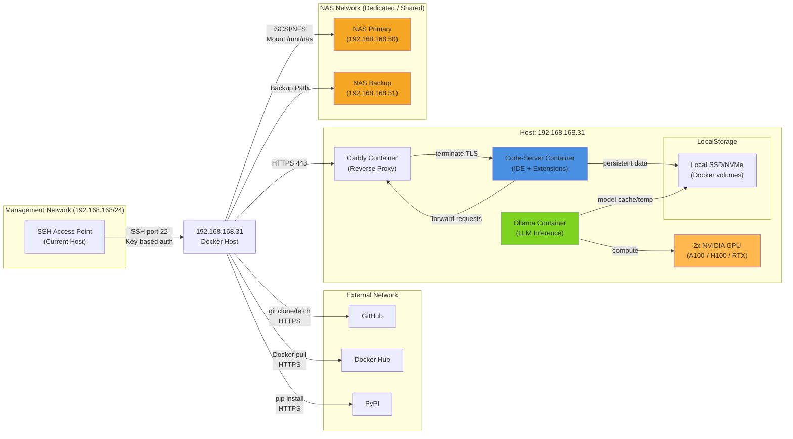

# Network Topology: 192.168.168.31

**Status**: Draft - Assessment in progress  
**Purpose**: Visualize network architecture for code-server-enterprise deployment

## High-Level Topology



## Detailed Component Architecture

### 1. Management Access Path
```
Developer Machine
    ↓ SSH key-based auth
192.168.168.31 (akushnir user)
    ↓ sudo for privileged ops
docker, docker-compose commands
    ↓ API
Docker containers (code-server, ollama, caddy)
```

**Network Requirements**:
- Inbound: SSH (port 22) from developer machines
- Outbound: HTTPS (443) for package downloads, Git, Docker Hub
- Firewall: Only port 22 required for management

### 2. Application Network Path
```
User Browser
    ↓ HTTPS (domain name or IP:443)
Caddy Reverse Proxy Container
    ↓ Internal Docker network
Code-Server Container
    ↓ IPC/sharedmem
GPU Driver
    ↓ Device access via /dev/nvidia*
NVIDIA GPU Hardware

Or: Caddy → Ollama Container → GPU Hardware
```

**Network Requirements**:
- Inbound: HTTPS (443) for user access
- Internal: Docker bridge network for inter-container communication
- GPU: Direct device access (nvidia-container-runtime)

### 3. NAS Storage Path (Primary)
```
Docker Containers
    ↓ Linux mount /mnt/nas-primary
NFS v4 / iSCSI Protocol
    ↓ Network (10Gbps preferred, 1Gbps minimum)
NAS Primary (192.168.168.50)
    ↓ Network latency SLA: <50ms p99
NAS Storage Arrays
    ↓ Performance: >500MB/s sequential
RAID Storage Backend
```

**Network Requirements**:
- Outbound: iSCSI (port 3260) or NFS (port 2049, 111) to NAS
- Network bandwidth: >1Gbps (10Gbps for optimal performance)
- Latency objective: <10ms average, <50ms p99
- Mount type: Persistent (survives container restart)

### 4. NAS Backup Path (Secondary)
```
Automated Backup Process (Cron/Systemd)
    ↓ rsync/rclone
192.168.168.31:/mnt/nas-primary (mounted data)
    ↓ Network
NAS Backup (192.168.168.51)
    ↓ Separate physical location
Offline Archive (tiered retention)
```

**Requirements**:
- Backup frequency: Hourly incremental, daily full
- Capacity: >50% of primary NAS size
- Network: Can share with primary or dedicated segment

## Network Addressing Plan

| Device/Service | IP Address | Port(s) | Protocol | Purpose |
|---|---|---|---|---|
| **Management** |  |  |  |  |
| Developer Host | [External] | → 22 | SSH TCP | Remote management |
| SSH Bastion (if needed) | [If applicable] | 22 | SSH TCP | SSH hop point |
| **192.168.168.31 Host** |  |  |  |  |
| Primary NIC | 192.168.168.31 | 22, 443 | SSH, HTTPS | Mgmt + applications |
| Secondary NIC (optional) | 192.168.168.32 (or VLAN) | NFS/iSCSI | iSCSI/NFS | Dedicated NAS network |
| Docker Bridge | 172.17.0.0/16 (default) | Multiple | TCP/UDP | Inter-container comms |
| **NAS** |  |  |  |  |
| NAS Primary | 192.168.168.50 | 3260, 2049 | iSCSI/NFS | Primary storage |
| NAS Backup | 192.168.168.51 | 3260, 2049 | iSCSI/NFS | Backup storage |

## DNS Configuration

```
Forward DNS:
  - code-server-31.local → 192.168.168.31
  - nas-primary.local → 192.168.168.50
  - nas-backup.local → 192.168.168.51

Reverse DNS:
  - 192.168.168.31.in-addr.arpa → code-server-31.local
  - 192.168.168.50.in-addr.arpa → nas-primary.local
  - 192.168.168.51.in-addr.arpa → nas-backup.local

External DNS:
  - [Domain name] → [Public IP / ingress point]
```

## Firewall Rules

### Inbound to 192.168.168.31

| From | To | Port(s) | Protocol | Allowed | Purpose |
|---|---|---|---|---|---|
| Management VLAN/VPN | 192.168.168.31 | 22 | TCP | ✅ Yes | SSH access |
| Any (internet) | 192.168.168.31 | 443 | TCP | ✅ Yes | HTTPS user access |
| NAS Network | 192.168.168.31 | N/A | N/A | ✅ Yes | Return traffic from NAS |
| Any other | 192.168.168.31 | Any | Any | ❌ No | Implicit deny |

### Outbound from 192.168.168.31

| From | To | Port(s) | Protocol | Allowed | Purpose |
|---|---|---|---|---|---|
| 192.168.168.31 | 192.168.168.50/51 | 3260, 2049, 111 | TCP/UDP | ✅ Yes | NAS mount protocol |
| 192.168.168.31 | 8.8.8.8 (or ISP DNS) | 53 | UDP | ✅ Yes | DNS resolution |
| 192.168.168.31 | docker.io, gcr.io, etc | 443 | TCP | ✅ Yes | Container image pulls |
| 192.168.168.31 | github.com | 443 | TCP | ✅ Yes | Git clone/fetch |
| 192.168.168.31 | pypi.org, npm registry | 443 | TCP | ✅ Yes | Package downloads |
| 192.168.168.31 | Any other | Any | Any | ❌ No | Implicit deny |

## Bandwidth Allocation

| Path | Bandwidth Allocated | Actual Used | Notes |
|---|---|---|---|
| Management (SSH) | 1 Mbps | Minimal (<1 Mbps) | Low use |
| User Access (Browser HTTPS) | 100 Mbps | ~50 Mbps per concurrent user | Depends on IDE activity |
| NAS Storage (iSCSI/NFS) | 1 Gbps (dedicated) | 100-500 Mbps | Peaks during inference, sync |
| External (Package downloads) | 100 Mbps | Minimal (during setup) | Mostly during container build |
| **Total Available** | **~2 Gbps** | **Varies** | Assume 1Gbps primary, 1G backup/NAS |

## Latency SLAs

| Path | Target P50 | Target P99 | Measured P99 | Status |
|---|---|---|---|---|
| SSH Management | <5ms | <20ms | [PENDING] | [PENDING] |
| User Request (browser → caddy) | <50ms | <150ms | [PENDING] | [PENDING] |
| Code-Server IDE Response | <100ms | <200ms | [PENDING] | [PENDING] |
| NAS Mount (direct mount read) | <2ms | <50ms | [PENDING] | [PENDING] |
| NAS Inference Model Load | <5s | <10s | [PENDING] | [PENDING] |
| GPU Inference Latency | <500ms | <1s | [PENDING] | [PENDING] |

## Reliability & Redundancy

### Single Points of Failure (SPoF)

| Component | Current | Mitigation |
|---|---|---|
| 192.168.168.31 host | **CRITICAL** | Auto-recovery via systemd, health monitoring |
| GPU drivers | **HIGH** | Driver pinning, auto-restart |
| NAS Primary | **CRITICAL** | Backup NAS, regular syncs, offsite archive |
| Caddy reverse proxy | Medium | Container auto-restart, health probes |
| Network interface | **CRITICAL** | Secondary NIC option (future expansion) |

### Failover Strategy

1. **Single Container Failure** → Docker auto-restart (health check)
2. **NAS Primary Failure** → Auto-failover to NAS Backup (via failover script)
3. **Host Network Failure** → Manual intervention + DNS update (if secondary exists)
4. **Complete Host Failure** → Rebuild from IaC, restore from NAS backup

## Data Flow Examples

### Example 1: User Opens Code-Server IDE

```
User Browser (10.0.0.100)
    ↓ HTTPS request to code-server-31.local:443
192.168.168.31:443 (Caddy reverse proxy)
    ↓ Forward to internal Docker container
Code-Server Container (172.17.0.2:8080)
    ↓ Serve IDE HTML/JS/CSS
    ↓ Code files from /mnt/nas-primary (mounted)
User Browser
    ↓ Display IDE UI
```

Latency budget: <150ms total (network + application)

### Example 2: Run LLM Inference

```
Code-Server IDE
    ↓ Run `/mnt/nas-models/llama2:70b-chat --prompt "..."`
Ollama Container
    ↓ Load model from /mnt/nas-models (NAS mount)
    ↓ Execute on GPU (2x NVIDIA A100)
GPU Hardware
    ↓ Generate tokens at 50+ tokens/sec
Ollama Container
    ↓ Stream results back to IDE
Code-Server IDE
    ↓ Display output in terminal/editor
```

Latency budget: <500ms first token, then streaming

### Example 3: Automated Backup

```
Cron Job (Systemd timer)
    ↓ Snapshot /mnt/nas-primary at midnight
Backup Process
    ↓ Incremental rsync to /mnt/nas-backup
NAS Backup
    ↓ Store on separate physical storage
Off-Site Archive
    ↓ Weekly export to cloud/tape
```

Backup window: 2 hours, RPO: <1 hour, RTO: <5 minutes (for NAS primary)

---

## Assessment Status

- [ ] Confirm network connectivity (SSH to 192.168.168.31)
- [ ] Measure latency (SSH, NAS, Internet)
- [ ] Identify network bottlenecks
- [ ] Confirm DNS resolution
- [ ] Identify firewall rules (if in place)
- [ ] Validate bandwidth allocation
- [ ] Confirm NAS network segment (dedicated or shared)
- [ ] Document secondary NIC (if available)
- [ ] Update actual measurements vs. targets

---

**Related Issue**: #139 (Infrastructure Assessment)  
**Next**: Update with actual measurements from assessment script  
**Status**: IN PROGRESS

